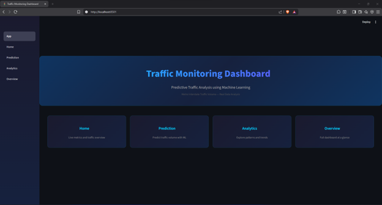
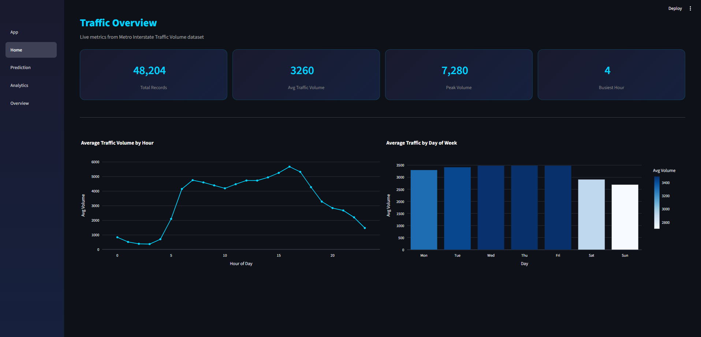
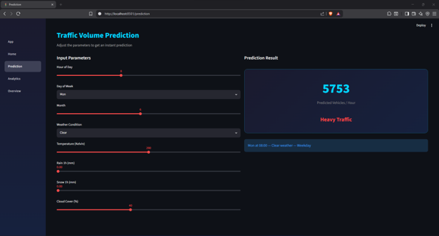
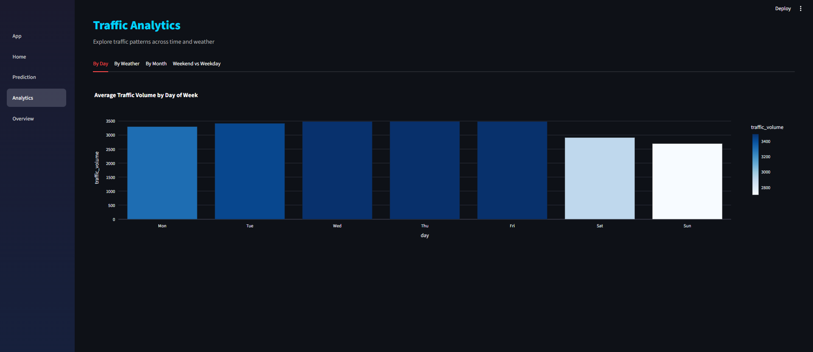
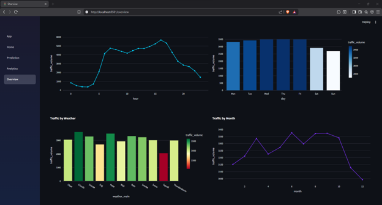
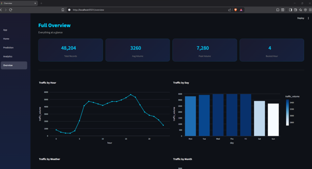

# Traffic Monitoring Dashboard with Predictive Analysis

A Machine Learning-powered Streamlit dashboard that predicts traffic volume from historical time and weather data, shifting traffic management from reactive to proactive. Final Year Project (Unit 21: Emerging Technologies).

## The Problem & Solution

Traditional traffic management is entirely reactive — congestion is only detected once it has already formed, by which point response is too late. This project flips that: a Random Forest regression model trained on real historical traffic data predicts volume *before* congestion occurs, giving transport authorities and commuters a forward-looking estimate instead of a live snapshot.

## Tools & Technologies

- **Python** — data cleaning, model training, application logic
- **scikit-learn** — Random Forest Regression
- **Pandas** — data cleaning and feature engineering
- **Streamlit** — interactive web dashboard
- **PyCharm** — development environment

## Dataset

- **Source:** [Metro Interstate Traffic Volume](https://www.kaggle.com/datasets/anshtanwar/metro-interstate-traffic-volume) (Kaggle, originally Hogue, 2019 — UCI Machine Learning Repository)
- **License:** CC BY 4.0 (Attribution 4.0 International) — redistribution permitted with credit
- **Size:** 48,204 hourly records, Minnesota interstate, 2012–2018, including weather and holiday fields
- The cleaned dataset (`data/traffic_cleaned.csv`) is included in this repo under the dataset's license terms, with full attribution given here and in-code. The original raw file (`data/Metro_Interstate_Traffic_Volume.csv`) is also included, showing the starting point before cleaning.

## Model Performance

| Metric | Value |
|---|---|
| RMSE | 689.31 vehicles/hr |
| R² Score | 0.8798 |

An R² above 0.80 is considered strong for real-world traffic regression, meaning the model explains ~88% of the variance in traffic volume from time and weather features alone. **Feature importance** shows **hour of day** as by far the dominant predictor (~0.80 importance), consistent with the two clear rush-hour peaks (8 AM / 5 PM) visible in exploratory analysis — followed by temperature, day of week, month, and weather conditions.

## Development Process

The dashboard's feature set wasn't guessed — it was built from a structured 28-respondent survey conducted before development began, then refined across three tested iterations:

- **V1 — Baseline:** Basic Streamlit app, default white theme, 3 pages. Feedback identified an unfinished-looking theme, file path errors, and inconsistent label casing.
- **V2 — Feedback-driven redesign:** Custom dark CSS theme, fixed paths, styled metric cards. A real bug was found and fixed — a Holiday `LabelEncoder` class mismatch causing a crash on unseen categories, resolved by retraining and saving a dedicated `le_holiday.pkl` encoder. An Overview page was added after users said navigating between pages to see all data was inconvenient.
- **V3 — Final build:** Full end-to-end testing passed with no errors; all 5 pages working with functional navigation. This is the version in this repo.

Survey highlights that shaped the design: 78.6% of respondents rated the concept 4–5/5 for usefulness, and 96.4% said a prediction would actually change their travel behaviour — both well above the ~60% threshold typically used to demonstrate genuine end-user value.

## Dashboard Pages

1. **Landing Page** — 4 clickable navigation cards, dark custom theme
2. **Home Page** — key metric cards (total records, average/peak volume, busiest hour), traffic-by-hour line chart, traffic-by-day bar chart
3. **Prediction Page** — live ML prediction: input hour, day, month, weather, temperature → get a Heavy/Moderate/Light traffic estimate with colour coding
4. **Analytics Page** — 4-tab explorer: Day of Week, Weather Impact, Monthly View, Weekday vs Weekend
5. **Overview Page** — all metrics and charts on a single scrollable page

**Screenshots:**








## Key Insights

- **Hour of day is the single dominant driver of traffic volume** (~80% feature importance), far ahead of weather, day of week, or month — confirming the classic two-peak rush-hour pattern (8 AM, 5 PM) seen throughout the data.
- **Weather has a measurable but secondary effect** — rain and clear conditions produce visibly different predicted volumes for the same hour, but the effect is much smaller than time-of-day.
- **Weekdays are consistently busier than weekends**, with Friday peaking highest — visible both in the raw EDA and reflected in the Analytics page's weekday/weekend comparison tab.

## Limitations

- **Local deployment only** — currently runs on localhost; not yet deployed publicly (Streamlit Cloud deployment is a planned next step).
- **Static historical data (2012–2018)**, no live feed — predictions are based on historical patterns, not real-time conditions.
- **Geographically specific** — trained on Minnesota, USA data; would need retraining on local data to be accurate elsewhere. The architecture is dataset-agnostic by design, so this is a data-swap, not a rebuild.
- **Manual weather input** — users currently enter weather conditions manually rather than the app auto-fetching them.

## Future Roadmap

1. Live traffic API integration (Google Maps / TomTom) to replace the static CSV with real-time data
2. Streamlit Cloud deployment for public browser access
3. Automated model retraining pipeline as new data accumulates
4. Localisation — retrain on region-specific data (e.g. Sri Lanka)
5. User accounts and personalised alerts
6. Full production architecture (Flask/React/PostgreSQL)

## How to Run

1. Clone this repo
2. Install dependencies:
   ```bash
   pip install -r requirements.txt
   ```
3. Run the dashboard:
   ```bash
   streamlit run dashboard/app.py
   ```
4. The app opens in your browser at `http://localhost:8501`

## Repo Structure

```
TrafficDashboard/
├── dashboard/
│   ├── app.py
│   └── pages/
│       ├── 01_home.py
│       ├── 02_prediction.py
│       ├── 03_analytics.py
│       └── 04_overview.py
├── data/
│   ├── Metro_Interstate_Traffic_Volume.csv
│   └── traffic_cleaned.csv
├── models/
│   ├── traffic_model.pkl
│   ├── le_holiday.pkl
│   └── le_weather.pkl
├── notebooks/
│   ├── 01_data_cleaning.ipynb
│   ├── 02_eda.ipynb
│   └── 03_ml_model.ipynb
├── screenshots/
│   ├── landing_page.png
│   ├── home_page.png
│   ├── prediction_page.png
│   ├── analytics_page.png
│   ├── overview_page.png
│   └── overview_page01.png
├── requirements.txt
└── README.md
```

## Skills Demonstrated

Machine Learning (Random Forest Regression), data cleaning and feature engineering (Pandas), model evaluation (RMSE, R², feature importance), dashboard/web app development (Streamlit), evidence-based, iterative development driven by real user feedback, end-to-end ML pipeline design.

## Attribution

Dataset: Hogue, A. (2019). *Metro Interstate Traffic Volume* [Dataset]. UCI Machine Learning Repository, via [Kaggle](https://www.kaggle.com/datasets/anshtanwar/metro-interstate-traffic-volume). Licensed under CC BY 4.0.
